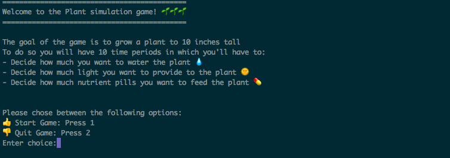

# Plant Simulation Game :seedling:

## Goal of the Game

The player’s goal is to grow a plant :seedling: to `max_plant_size` inches tall, over a `max_time_periods` periods of time. 

Player can:

- droplet :droplet: (increase/decrease) water the plant, 
- sun turn :sunny: on a sun lamp (increase/decrease light), 
- pill :pill: provide nutrients (increase/decrease pills) 

Too little or too much of any and the plant dies :skull:

Goal is to find a healthy ratio so that plant grows and acheives `max_plant_size` inches before the end of the `max_time_periods` periods of time.

## Mechanics of the game

In order to simplify the game mechancics, it has been assumed that the game has a specific duration limit (time periods). 

At each round (time period) a player will have the possibility to perform some action to make the plant grow

It has also been assumed that a plant has the following properties and attributes:

- a plant has `consumption rates` of water (w), light (l) and nutrients (n) depending of it's size
- meaning that it has a `therical need` in water, light and nutrients
- At each time period a player by increasing or decreasing each of the ressources (w,l,n) will `make available` a certain volume of water, quantity of nutrients and light for the plant to consume over a single time period
- a plant has `boundaries of mininmal and maximal` water, light and nutrients it needs to survive over a time period (it dies otherwise)
- at the begining of each time period the `available ressources are updated` based on the plant consumption (w and n only) over the previous period of time 
- a plant has also `growing rates` for each of the consumed water, nutrients and used light
- coefficients (c1, c2, c3) have been associated to each of the parameters (w, l, n) when computing the plant's growth over a time period (simulate a sensitivity of the plants for each of the parameters)
- Growth (G) of a plant over a time period is computed as follow:

```
G =  c1 * water_growth_rate * consumed_water + 
     c2 * light_growth_rate * used_light +
     c3 * nutrients_growth_rate * consumed_nutrients
```

**The game ends once either:**

- the plant reaches the required size before the end of the time periods
- the plant does not reach the required size before the end of the time periods
- the plant dies because it has been provided too much or not enough water, light or nutrients


## Running the game

To run the game you will need a `> Python 3.6` environment

You'll need to install the following modules:

- `pip install numpy`
- `pip install docopt`
- `pip install emoji`

Running the game:

```
run.py <max_time_periods> <max_plant_size>

Arguments:
    <max_time_periods>       Number (integer) of rounds in the game (# time periods)
    <max_plant_size>       Plant's size (integer) to reach before the end of the game (in inches)

Options:
    -h --help                Show this screen
```

The game will then run in a Terminal




